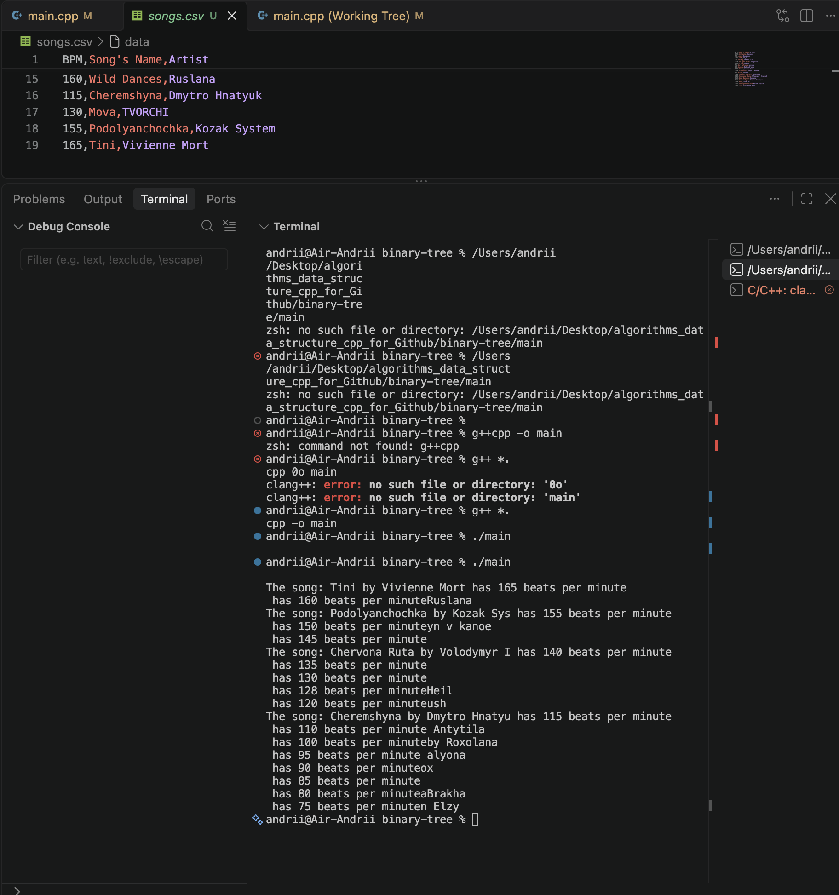

Since I've tried just to use getline() to get the value of a file, by reading it by line, it didn't work as I thought it would because as I later found out, .csv adds after each line not only '\0', i.e. the end of a line, but also '\r'.  
To remember: every .csv file ends with '\r' and '\n', except for the very last line, which look the next way: '\r\n'. '\r' returns a carriage(cursor) to the beginning of a current line, \\n' changes a line, i.e. we changes the current line to the next; 
That's why my file reading didn't work:
